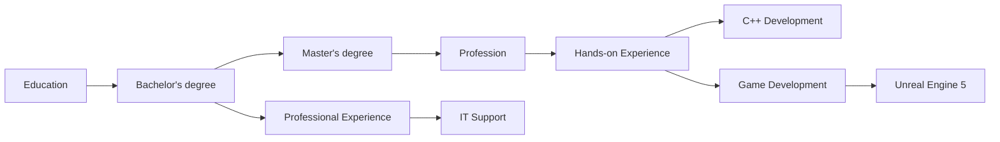

#  Hello, my name is Gegham Khachatryan

# Summary
*I am a technical support engineer with 4 years of experience. My work in technical support has provided me with valuable experience in customer service, including effective communication and problem-solving skills. I have also learned how to work collaboratively as part of a team and manage my time effectively. Since I studied programming at university for 6 years, I want to change my area of work and continue to develop my programming skills and use them to create high-quality software products. I am looking for a team where I can learn from experienced colleagues, collaborate on complex projects, and use my knowledge to achieve successful results.*

# Links

 - E-Mail: [kgegham@outlook.com](mailto:%20kgegham@outlook.com)
 - [www.linkedin.com/in/Geghamk/](https://www.linkedin.com/in/Geghamk/)
 - https://github.com/GeghamKH
 - https://leetcode.com/GeghamKhachatryan/

# Education
**Synopsys Armenia Educational Department**
 > Master of Science | Sep 2021 - Jun 2023 |
 > Specialization: Software Engineering
 
 **Synopsys Armenia Educational Department** 
 > Bachelor of Science | Sep 2019 - Jun 2021 |
 > Specialization: Software Engineering

**State Engineering University of Armenia**
 > Bachelor of Science | Sep 2017 - Jun 2021 |
 > Specialization: Computer Systems and Informatics Department

**Courses**
 - [#SimpleCode - C++ for   Beginners.](https://www.youtube.com/watch?v=kRcbYLK3OnQ&list=PLQOaTSbfxUtCrKs0nicOg2npJQYSPGO9r)
 - [Ravesli - C++ Lessons](https://ravesli.com/uroki-cpp/)
 - [Konstantin Vladimirov - C++ courses (MIPT,   ILab)](https://www.youtube.com/@tilir/playlists)
 - [Refactoring.guru - DESIGN   PATTERNS](https://refactoring.guru/design-patterns)

## Books
>$
## Books I plan to read
>$ 

## Languages

 - Armenian -Native
 - Russian - Full professional proficiency
 - English - Limited working proficiency

# Professional Experience

***Synopsys, Yerevan, Armenia | Feb 2023 - present
IT Technical Support Mid***

 - Participate in IT projects to provide PowerShell automation support and meet project objectives.
 - Develop and maintain PowerShell scripts    to automate routine tasks such as installing certificates, adding to    groups, changing user policies, and fixing recurring issues.
 - Collaborate with cross-functional teams to identify automation opportunities and implement solutions.  
 - Provided technical support to    end-users on desktops, laptops and mobile phones issues, including    hardware and software troubleshooting.

***Synopsys, Yerevan, Armenia | Sep 2021 - Feb 2023
IT Technical Support Junior***

-   Worked with new employees and set up new equipment for them.
-   Repaired hardware as necessary and work closely with service vendors to ensure continuity of service.
-   Provided comprehensive support, problem resolution, and navigational assistance for customers via chat, email, and phone.
-   Collaborated with the Logistics and procurement teams to purchase new hardware.

***Synopsys, Yerevan, Armenia | Sep 2019 - Sep 2021
IT Technical Support Intern***
-   Resolved issues related to Windows, network connectivity, as well as problems associated with software and hardware errors.
-   Configured hardware, devices, and software to set up workstations for employees.
-   Assisting users in person and remotely with hardware-related concerns.

# IT Support skills

 ***Operating Systems:***

-   Proficiency in supporting and troubleshooting various operating systems, including Windows and Linux.

***Networking:***

-   Understanding of basic networking concepts, TCP/IP, DHCP, DNS, and troubleshooting network connectivity issues.
-   Familiarity with routers, switches, and firewalls.

***Hardware:***

-   Knowledge of computer hardware components, including troubleshooting hardware-related issues.
-   Experience with hardware installation and upgrades

***Software Applications:***

-   Ability to install, configure, and troubleshoot software applications.
-   Familiarity with common office software suites and productivity tools.

***Troubleshooting Skills:***

-   Strong problem-solving skills to diagnose and resolve technical issues efficiently.
-   Experience with systematic troubleshooting methodologies.

***Remote Support:***

-   Proficiency in providing remote support to end-users using remote desktop tools.
-   Knowledge of VPNs and remote access solutions.

***Customer Service:***

-   Excellent customer service skills with the ability to communicate technical information in a clear and understandable manner.
-   Patience and empathy in dealing with end-users.

***Security Awareness:***

-   Basic understanding of cybersecurity principles.
-   Ability to educate end-users about security best practices.

***Active Directory:***

-   Basic knowledge of Active Directory and experience with user account management, group policies, and permissions.

***Documentation:***

-   Ability to create and maintain documentation for support procedures, issue resolution, and configurations.

***Scripting and Automation:***

-   Scripting skills to automate repetitive tasks.
-   Familiarity with scripting languages such as PowerShell and Bash.

***Hardware and Software Inventory Management:***

-   Experience with tracking and managing hardware and software assets.

# Programming hands-on experience with 

***Data structures and algorithms:***

-   Implement and understand common data structures (arrays, linked lists, trees, graphs, etc.) and algorithms (sorting, searching, dynamic programming, etc.) in C++.

***Memory management:***

-   Smart pointers, memory allocation, deallocation, and handling memory leaks. Practice using tools like Valgrind for memory profiling and debugging.

***Multi-threading and concurrency:***

-   Understanding of multi-threading concepts, synchronization primitives (mutexes, condition variables), and threading libraries such as std::thread and POSIX threads. Implement multi-threaded applications and explore ways to handle race conditions and deadlocks.

***Object-oriented programming (OOP):***

-   Knowledge of OOP principles, including inheritance, polymorphism, encapsulation, and abstraction. Apply these principles to design and implement C++ applications.

***Template Metaprogramming:***

-   C++ template features such as template specialization, template argument deduction, and variadic templates. Implement template-based solutions for generic programming problems

***GUI programming:***

-   Basic experience with a GUI library such as Qt. Develop graphical applications with explore event-driven programming concepts.

***Operating systems:*** 
- Understanding the concepts of processes and threads. Knowledge of memory segmentation, paging, and virtual memory concepts. Ability to work with command-line interfaces.

# Game dev hands-on experience with

***Unreal Engine Basics:***

-   Familiar with the Unreal Engine interface, editor navigation, and project setup.

***Blueprint Visual Scripting:***

-   Basics of visual scripting using Blueprints to create game logic without extensive coding.

***C++ Programming in Unreal Engine:***

-   Basics of C++ programming within the Unreal Engine framework for more advanced and performance tasks.

***Level Design:***

-   Level design principles, including creating environments, placing assets, and optimizing levels for performance.

***SFML Library:***

-   Using the SFML library, I've written games similar to Mario, Tetris, and mazes.

# Familiar and improving knowledge

 - Unreal Engine 4 & 5
 - Jenkins, GitLab
 - Selenium
 - Docker 
 - AWS, Microsoft Azure
 - Terraform, Ansible

# Ways and knowledge

